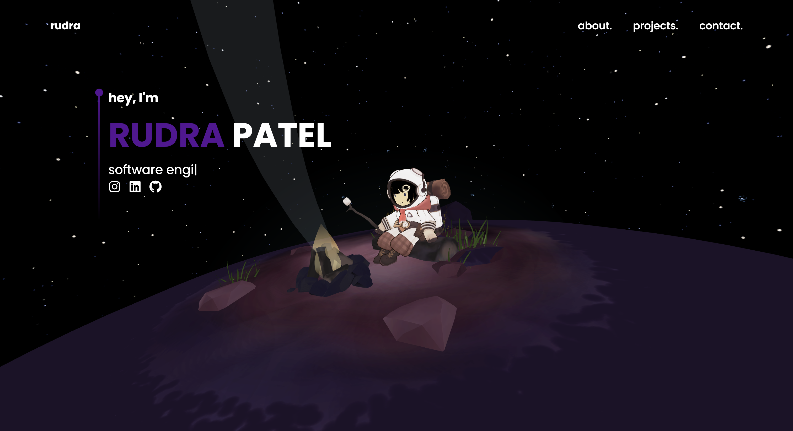

# 3D Portfolio Website

A modern, interactive portfolio website featuring a 3D space model that responds to user scrolling. Built with React, Three.js, and EmailJS.



## Features

- **Interactive 3D Model**: A space-themed 3D model that rotates and moves based on scroll position
- **Smooth Transitions**: Custom scroll-based animations between sections
- **Responsive Design**: Fully responsive layout that works on all device sizes
- **Contact Form**: Functional contact form integrated with EmailJS
- **Section Navigation**: Smooth scrolling navigation between different sections:
  - Landing
  - About
  - Projects
  - Contact

## Technologies Used

- **Frontend Framework**: React
- **3D Graphics**: Three.js with React Three Fiber
- **Email Integration**: EmailJS for contact form

## Project Structure

```
portfolio-website/
├── public/
│   ├── imgs/                # Project images
│   └── space-3dmodel/       # 3D model files
├── src/
│   ├── components/          # React components
│   │   ├── About.jsx       # About section
│   │   ├── Contact.jsx     # Contact form
│   │   ├── Landing.jsx     # Landing page
│   │   ├── Navbar.jsx      # Navigation
│   │   ├── Projects.jsx    # Projects carousel
│   │   ├── Scene.jsx       # 3D scene setup
│   │   └── Socials.jsx     # Social media links
│   ├── App.jsx             # Main app component
│   ├── main.jsx           # Entry point
│   └── index.css          # Global styles
└── package.json           # Dependencies and scripts
```

## Features in Detail

### 3D Space Model
- Interactive 3D model that rotates continuously on the landing page
- Responds to scroll position with smooth camera movements
- Custom animations for transitions between sections

### Smooth Navigation
- Custom scroll-based navigation system
- Smooth transitions between sections
- Progress-based visibility for different components

### Responsive Design
- Mobile-first approach
- Adapts to different screen sizes
- Optimized layouts for desktop, tablet, and mobile

### Contact Form
- Integrated with EmailJS for sending messages
- Form validation
- Success/error states with visual feedback
- Auto-reset after successful submission

## License

This project is licensed under the MIT License - see the LICENSE file for details.

## Acknowledgments

- 3D model source - This work is based on "Space Ame Camping - Amelia Watson Hololive" (https://sketchfab.com/3d-models/space-ame-camping-amelia-watson-hololive-56ede5352988499d92892fed6061388e) by Seafoam (https://sketchfab.com/seafoam) licensed under CC-BY-NC-4.0 (http://creativecommons.org/licenses/by-nc/4.0/)
- Icons from React Icons
